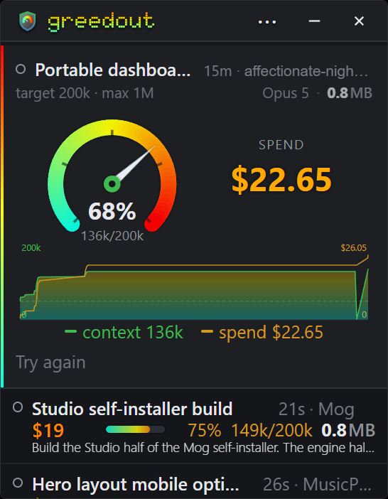

# Greedout

[](https://github.com/kjustinkeener/Greedout/actions/workflows/ci.yml)

An always-on-top dashboard showing your most recently active AI coding sessions as live
gauges: how full each one's context window is, what it has cost so far, and how that has
moved over the session. **Claude Code** is the harness it supports today.

It works by reading the harness's own transcript files from disk (for Claude Code, the
JSONL under `~/.claude/projects`). Nothing is injected into the harness, no proxy sits in
front of it, and the app never needs an API key. Nothing in the gauges, the history graph
or the cost model is specific to one vendor: a harness qualifies once it writes per-turn
token counts somewhere on disk.

> **Why it exists:** context and spend readouts usually live inside the harness, one
> session at a time, and go missing entirely when the harness has no terminal to print
> them in. Claude Code's `statusLine`, for instance, never fires in the Windows MSIX
> desktop app. Greedout reconstructs the readout from the outside, and along the way gets
> to show several sessions at once rather than only the one in front of you.

<p align="center">
  
</p>

## Features

- **Live context gauges** for the N most recent sessions, sized against the model's
  target window, with the focused session promoted to a larger panel and a speedometer.
- **Estimated spend** per session, priced per turn by the model that actually ran it.
- **History graph** of context and cumulative cost across a session's turns.
- **Context Explorer**: a treemap breakdown of what is actually occupying a session's
  context, drilling from category down to individual messages and tool blocks, plus
  full-text search across chat content.
- **Browse** every session and project on disk, zooming from harness to project to
  session, with tiles sized by transcript size.
- **68 themes**, a **font picker** with roughly 50 bundled faces across three slots,
  Ctrl+wheel zoom, an optional CPU/memory status bar, and a system tray icon.

## Platform support

**Windows 10 and 11.** The app builds on other platforms, but two features are
Windows-only and degrade to doing nothing: enumerating installed system fonts (reads the
Fonts registry key) and detecting which session currently has focus (reads the Claude
desktop app's packaged-app data directory). Everything else is portable in principle but
untested elsewhere.

## Install

Greedout ships as a single `greedout.exe` and installs itself. Run the downloaded
exe and it shows an install card instead of the gauge window; it copies itself to
`%LOCALAPPDATA%\Greedout`, adds a Start Menu shortcut (a desktop one if you tick
the box), and registers itself under Installed apps so it uninstalls the ordinary
way.

Per-user, so there is no administrator prompt, and nothing is written outside that
folder and `~/.claude/greedout`. Uninstalling removes both the folder and the
shortcuts; your settings sidecar is left alone.

Downloads are on the [releases page](https://github.com/kjustinkeener/Greedout/releases).
[fasterdb.com/software/greedout](https://fasterdb.com/software/greedout/) is the project
page on my own site, and the address the install card links to. If there is no release
yet, build from source, below.

## Build from source

Prerequisites:

- **Rust** (stable, 1.77 or newer) via [rustup](https://rustup.rs/)
- **Node.js** 24 or newer. Not optional: the translation check imports the catalogs as
  TypeScript and relies on Node stripping the types, which older releases do not do, and
  the bundler needs 20+. CI pins 24 for the same reason.
- The [Tauri v2 prerequisites](https://v2.tauri.app/start/prerequisites/) for your
  platform. On Windows that means the **MSVC C++ build tools** and the **WebView2
  runtime** (already present on Windows 11 and up-to-date Windows 10).

Then, from the repo root:

```powershell
npm install
npm run tauri dev
```

To produce the release exe:

```powershell
npm run release
```

That is `tauri build --no-bundle`. There is deliberately no MSI or NSIS target:
those install into Program Files, where replacing the running exe needs
administrator rights, which is exactly what the self-installer avoids.

### Cutting a release

Version lives in three files and they must agree, because the updater compares
them with the version in the published manifest: `package.json`,
`src-tauri/tauri.conf.json`, and `src-tauri/Cargo.toml` (then
`cargo update -p greedout --precise X.Y.Z` to match the lockfile).

Pushing a `vX.Y.Z` tag builds the exe, signs it, writes `update.json`, and opens
a **draft** release. Drafts are invisible to installed copies, which is the
point: verify before publishing.

```powershell
gh release download vX.Y.Z -p greedout.exe -p update.json -D $HOME\greedout-rel
cargo run --release --manifest-path tools/verify-release/Cargo.toml -- $HOME\greedout-rel
```

Both lines matter. `VERIFY_OK` says an installed copy will accept this build;
`tampered rejected: true` says the verifier is actually checking something. Then
publish, which is the moment existing installs start seeing it:

```powershell
gh release edit vX.Y.Z --draft=false --latest
```

`npm run check` runs `svelte-check` and the translation gate
(`scripts/check-locales.mjs`), which is the check that makes Node 24 mandatory.

For the Rust side, build the frontend first: the crate embeds `dist/`, so
`cargo check` from `src-tauri/` fails on a fresh clone until `npm run build` has
run once. CI does the same, in that order.

```powershell
npm run build
cargo check --locked --manifest-path src-tauri/Cargo.toml
```

## Configuration

Settings live in `~/.claude/greedout/config.json`, created with defaults on first run.
Most of it is reachable from the Settings window, so hand-editing is rarely necessary.

The keys that matter most:

| Key | Default | Meaning |
|---|---|---|
| `n` | `5` | How many sessions to show |
| `poll_seconds` | `2` | How often to re-read transcripts |
| `target_tokens` | `200000` | Where the gauge redlines |
| `dim_hours` | `24` | Rows fade out over this many hours of inactivity |
| `follow_focus` | `true` | Pin whichever session has focus to the top |
| `theme` | `auto` | Theme id, or `auto` to follow the OS |
| `browse_enabled` / `explorer_enabled` | | Opt in to the disk cache the browse and Explorer windows use |

Custom row labels live in `~/.claude/greedout/labels.json`; double-click a row title to
rename it. Window position, size and zoom are remembered between runs.

## Privacy and network access

Greedout reads session transcripts (today, Claude Code's), which contain your prompts and
the model's replies, so it is worth being precise about where that data goes: **nowhere.** Everything
stays on the machine. There is no telemetry, no analytics, and no account.

The frontend is granted no filesystem, shell or HTTP permissions at all (see
`src-tauri/capabilities/default.json`); every disk read goes through an explicit Rust
command. The one exception is deliberate and narrow: clicking the website address on
the install card asks Rust to hand a link to your browser, and that command accepts
nothing but an `https` address with no whitespace in it.

Update checks are the app's only outbound connection. Once at launch, Greedout asks
GitHub whether a newer version exists and sends nothing beyond what any HTTPS request
inherently reveals: no session data, no identifiers, no usage. Turn off "Check for
updates at launch" in Settings and it never asks; the button in About still works when
you want to check by hand.

A downloaded update is verified against a signing key built into the app before a single
byte is written to disk. An update that fails that check is discarded and the running
copy is untouched.

## A note on the money figures

Costs are **estimates, not bills**. Each turn is priced from its own token counts at its
model's published per-token rate, so a session on a flat-rate plan still shows a figure:
what the same work would have cost through the API. Published prices are compiled into
the app and go stale when a vendor changes its rates.

## Licence

[MIT](LICENSE).

Bundled fonts and other third-party components carry their own licences; see
[THIRD-PARTY-NOTICES.md](THIRD-PARTY-NOTICES.md).

Greedout is an independent project. It is not affiliated with or endorsed by Anthropic.
